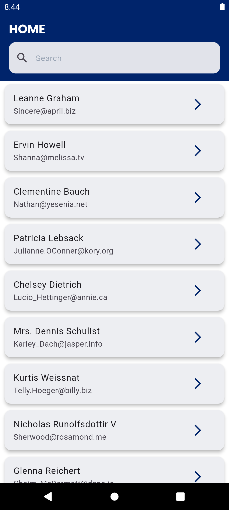
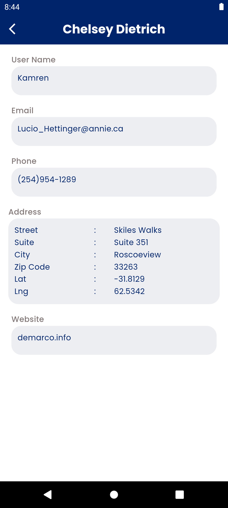

# User Information App

The User Information App is a dynamic and intuitive mobile application designed to display user information seamlessly using a REST API. It offers a clean, user-friendly interface that allows you to browse through a list of users, perform searches, and view detailed profiles with ease.

## Screenshots

Below are some screenshots of the app:


_Home Screen_


_User Details Screen_

## Installation

To install and run this app, follow these steps:

1. Clone the repository:
   ```bash
   git clone https://github.com/farhan-kt/AppScrip.git
   ```
2. Navigate to the project directory:
   ```bash
   cd your-repository
   ```
3. Install the dependencies:
   ```bash
   flutter pub get
   ```
4. Run the app:
   ```bash
   flutter run
   ```

## Usage

1. **Home Screen:** Browse through the list of users.
2. **User Details:** Click the arrow icon on a user card to view more detailed information about the user.
3. **Search:** Use the search bar to filter users by name.
